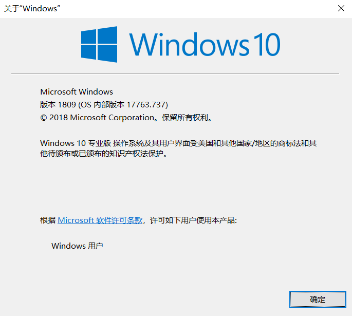
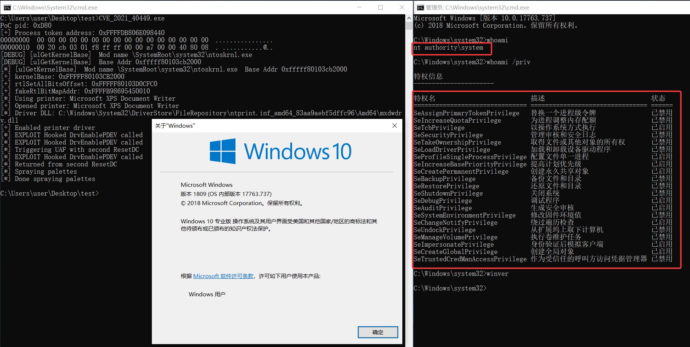

# CVE_2021_40449
poc and exp for CVE_2021_40449, related to my analyze, use cmake.

关于CVE-2021-1732复现的调试代码、poc和exp文件，使用cmake编写。

关于分析文章：

- 微信公众号：https://mp.weixin.qq.com/s/iFHugiO15urn8YVU6to6mQ
- 我的博客：https://joe1sn.eu.org/2026/07/12/CVE-2021-40449/

或许我们的微信公众号< **不止Sec** >会有你更多感兴趣的内容

复现环境

攻击结果

